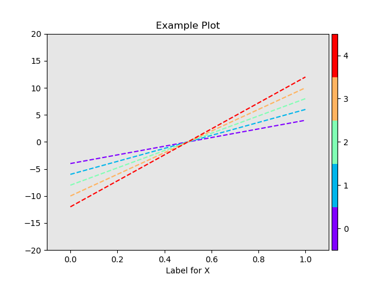
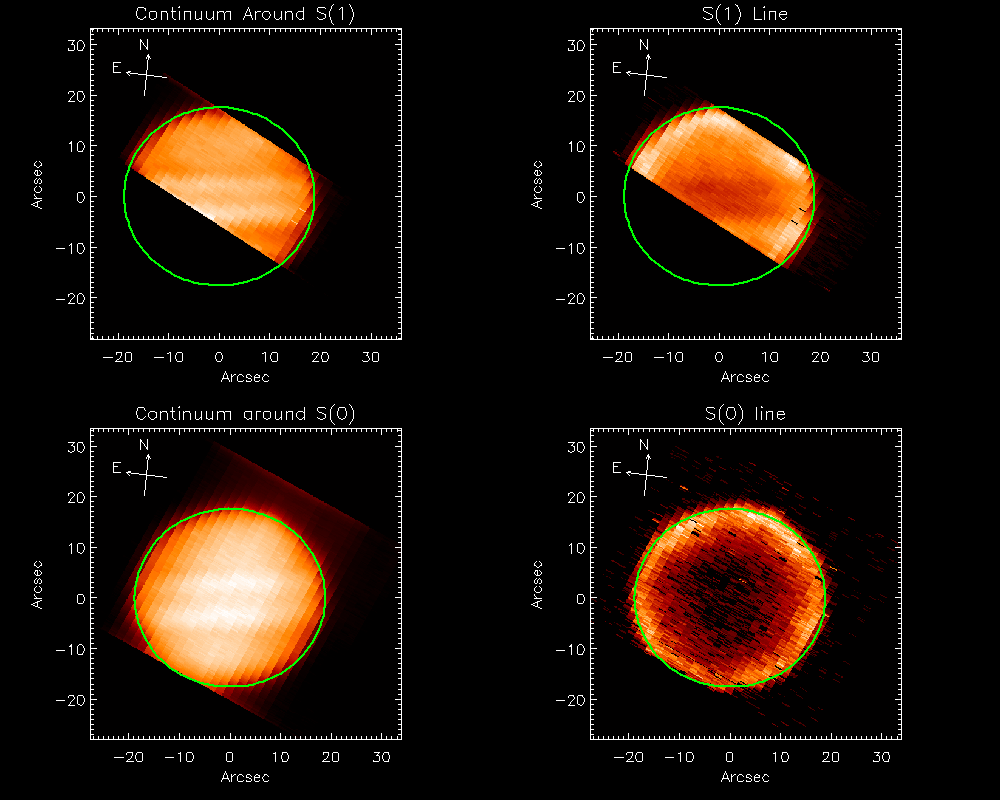
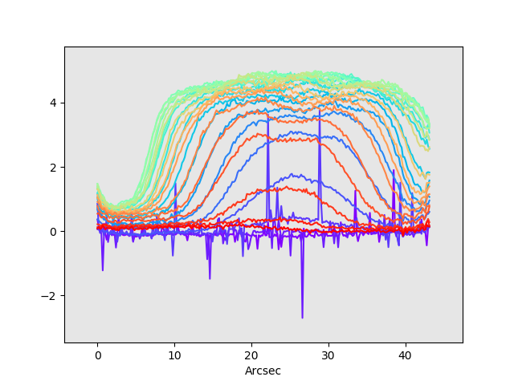

# Rainbowplot

The rainbowplot function plots each row of a 2D array as a color on a single figure. Useful for getting a "side view" of your data. 

Please see rainbowplot.py for usage and examples. 

Python 3 version ported from my original IDL version, which is included as rainbowplot.pro.

## Examples

After loading, run 

>>> rainbowexample()

to see an example plot.

    ```md
    
    ```

I wrote rainbowplot because I was curious about some bleeding light in a map of Jupiter, the one on the lower left in JupS0Bled.png. To see the result, run 

>>> plotjupiter()

with JupS0Bled.fits in the working directory. 


    ```md
        
    ```

(Jupiter hydrogen data taken using the EXES infrared spectrograph on NASA's airborne observatory SOFIA.)


